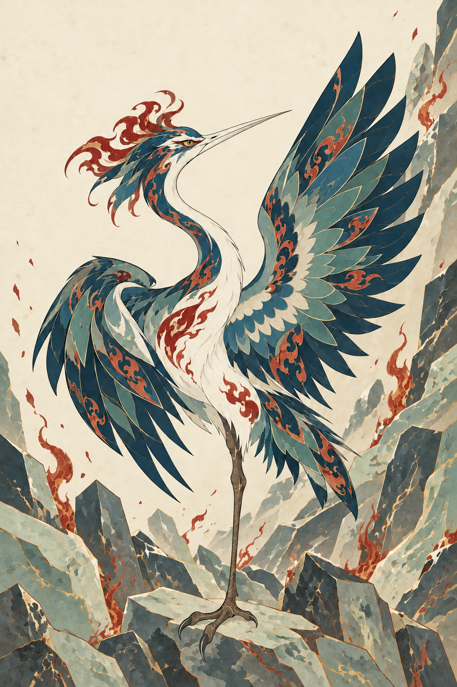

# 背景差异化 · 第二轮人工验收

状态：依据背景反馈完成 2 次内置生图编辑后，用户进一步要求先确定整体画风。两张图现归为暂存探索稿，暂不继续细化。Skill 已调整为 v0.3 的“先画风，后细节”流程；首轮主体也没有因沿用而自动获得认可。

[当前 Skill](../../../.agents/skills/mythic-beast-mural/SKILL.md) · [逐次调用记录](manifest.json)

## 反馈如何进入规则

用户要求：背景纹样与异兽的背景相匹配，避免重复造成视觉疲劳；整体是一套图，每幅又有新意。

- 保持：细线轻重、平涂形块、装饰层次、矿物色处理与精细程度。
- 重新设计：背景的语义、主纹样、方向、明暗疏密、留白和边缘装饰；不再默认卷云、串珠环、四角花框。
- 新增验收：背景是否贴合角色，以及并置时能否看到共同画法和各自的构图。具体方案应继续变化，不把本轮方案变成新的永久模板。

## 05 · 烛龙：晦明与层山

- 证据：[《山海经·大荒北经》章尾山条](https://zh.wikisource.org/wiki/山海經/大荒北經)记其暝晦、其视明。暗明色域、横向岩纹和具体山形是本次原创转译。
- 观察：旧背景的卷云、珠环、中央圆盘及角花已去掉，深蓝黑大面与骨白明域形成开阔交界，下方层山以横势回应蛇躯；相比首稿，整体明暗变化明显。
- 保形：人面、发饰、头后盘曲带、蛇躯主轮廓和主要鳞腹纹样目视保持。没有把主体上的珠饰误删成背景珠串。不声明逐像素不变。
- 待判断：山层较多、下部细线较密；是否有足够的装饰新意，还是偏向常见山水背景？头后盘曲带的连接疑问和仕女气质仍保留，本轮没有处理。
- [修改前](../2026-09-23-transfer-test/03-zhulong-color.png) · [完整实际提示词](prompts/01-zhulong-background.txt)。

## 06 · 毕方：瑶碧与火迹

- 证据：[《山海经·西山经》章莪山条](https://zh.wikisource.org/zh-hans/西山經)记无草木、多瑶碧，毕方出现与讹火相关。岩片矿脉与火迹的具体场景是原创演绎；不把它说成原文所述喷火能力。
- 观察：旧卷云、珠环和四角边框已移除；玉灰岩片集中于下方与右侧，斜向上升，上方和喙前留白，火迹与羽中红纹呼应。与烛龙的横势暗明构图形成区别。
- 保形：白喙、羽冠、两翼、唯一腿及足爪位置目视保持，翼尖仍完整入画，脚落在岩片上且轮廓可辨。
- 待判断：岩片切面具有一定体积联想，火迹数量与矿脉密度高于“少量”的预期；是否需要压平岩片、减少火迹，才能保持原系列轻盈的装饰感？羽冠华丽程度仍待判断。
- [修改前](../2026-09-23-transfer-test/04-bifang-color.png) · [完整实际提示词](prompts/02-bifang-background.txt)。

## 本轮结论与验收

两张图都完成了可见的背景主题与组织方式变化；共同的线条、主体画法和色彩处理仍可辨。背景是否贴合角色、整套图是否耐看以及每幅是否足够惊艳，均留待用户确认，不能由“不同了”直接推出“更好了”。

以上细节疑问暂存。当前先确认参考与试稿的总体线条、平面感、装饰层次、色彩处理和气质，之后再回到背景定制。

本次每个角色只编辑一次，没有追加抽图。两次编辑验证了背景修订方向，尚未验证从零生成时能否稳定执行新版规则。
