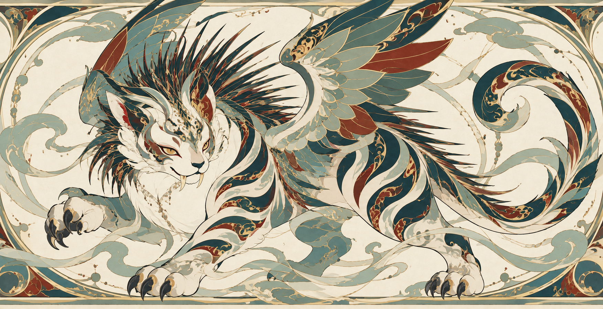
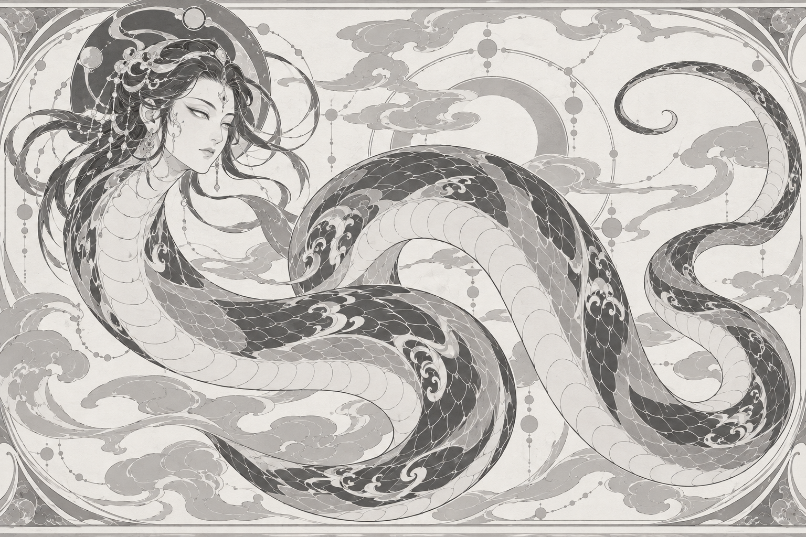
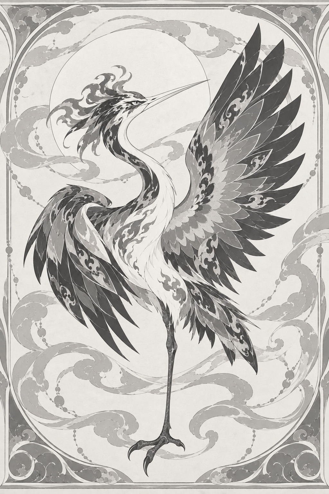
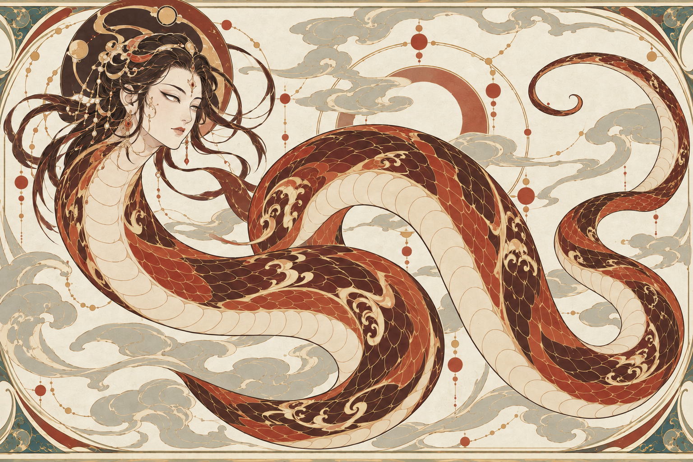
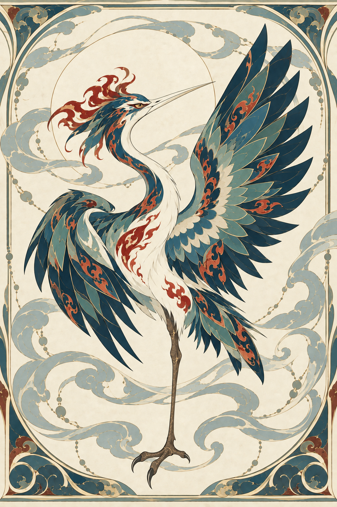

# 首轮人工验收

状态：5 次实际生图已完成，agent 已做目视检查。4 张当前候选和 1 张修正前版本均已保留，新图全部待人工验证。

后续反馈：用户指出背景与异兽语义联系不足，重复纹样容易造成疲劳。已更新 Skill 并完成[第二轮背景修订](../2026-09-23-background-test/REVIEW.md)；本页保留首轮原始观察与版本记录。

交互查看入口：[review.html](review.html)。可放大图像，分别填写画风、形态、保形判断，并导出意见。

## 已认可基准

基准来自用户提供的对话，只有穷奇黑白稿和彩稿已得到用户认可。

## 01 · 烛龙黑白结构稿

- 形态：已见一个人面、连续蛇身和渐细尾部，未见足、翼、角；身体转折处与云纹有一定视觉混杂，值得放大核对。
- 画风：平涂灰阶、细线、片块分组、云纹与微纹呼应接近基准。中层鳞片较规则，装饰化处理是否足够由用户判断。
- 人工重点：人面与发饰偏向仕女形象，古拙神性的程度待确认。不能把这一偶然输出当作所有烛龙的固定容貌。
- 完整提示词：[01-zhulong-gray.txt](prompts/01-zhulong-gray.txt)。

## 02 · 毕方黑白结构稿

- 首稿形态：鹤形长颈与长直喙，一条腿从腹部向下连接到一只分趾脚，两翼可辨。
- 实测问题：展开翼的最上方羽尖被裁掉，不满足本次提示词的完整入画要求。
- 修正结果：一次取景调整后，喙尖、展开翼尖、尾尖与足爪均已入画；保留可辨的一足结构。主体略缩小并调整位置，所以本次修正不声称逐像素保形。
- 画风：细线、羽片分组和平面灰阶延续了穷奇。头部羽冠略华丽，是否接近凤凰气质应由用户判断。
- [首稿](02-bifang-gray-v1.png)／[初始提示词](prompts/02-bifang-gray.txt)／[取景修正提示词](prompts/02b-bifang-framing.txt)。

## 03 · 烛龙彩色试稿

- 颜色：红褐与朱砂主导蛇身，骨白腹片、哑金细线，未照搬穷奇的青色主体。
- 保形：与01比较，人面位置、蛇躯主曲线、尾尖和主要纹样分区保持；这只是目视对照，不声明逐像素一致。
- 人工重点：头后及上方的弧带与蛇身容易发生视觉混淆；仕女式发饰和较华丽的金线是否符合“古拙神性”，需你判断。上色没有消除这些结构稿已有的疑问。
- 完整提示词：[03-zhulong-color.txt](prompts/03-zhulong-color.txt)。

## 04 · 毕方彩色试稿

- 颜色：青色羽片、朱红火舌纹与骨白长喙可辨，腿为灰褐色，背景为淡米色；大面积骨白胸颈是否合适由用户判断。
- 保形：以02修正版为编辑目标，头、喙、双翼、一条腿及足爪位置和主要羽片边界目视保持，翼尖仍完整入画。少量线色与微纹的视觉对比发生变化，不声明逐像素一致。
- 人工重点：红色羽冠比黑白时更醒目，可能加强凤凰联想；判断其华丽程度是否影响“鹤形毕方”的辨识。部分云纹、纸纹与细羽存在微弱色调变化，严格平涂程度也待确认。
- 完整提示词：[04-bifang-color.txt](prompts/04-bifang-color.txt)。

## Agent 检查结论

“通过”仅指本轮目视检查的具体项目，不等于用户认可。

| 项目 | 烛龙 | 毕方 |
| --- | --- | --- |
| 形态 | 待人工判断：人面蛇身可辨，但头后上方弧带与身体连接易混淆 | 通过可见数量和入画检查；羽冠气质待人工判断 |
| 画风 | 待人工判断：细线、片块和三级疏密可见；仕女气质需确认 | 待人工判断：羽片与微纹层次可见；冠羽华丽程度需确认 |
| 上色保形 | 通过主要轮廓和部位位置的目视对照 | 通过主要轮廓和部位位置的目视对照 |
| 人工偏好 | 待人工判断 | 待人工判断 |

本轮已把“参考图局部裁切会被沿用”的实测教训补入风格规范。尚未重测修改后的规范，因此不能声称该问题已经在后续生成中稳定消除。

## 验收方法

每张图可分别回复：

- 画风：符合期待／需要修改。
- 形态：成立／指出具体错误或模糊部位。
- 上色：是否保持结构，颜色是否合适。
- 决定：保留候选／修改后再看／认可结构／认可彩色稿／淘汰。

用户认可前，不将这些测试图加入 Skill 的已认可基准。

## 来源与测试边界

- 烛龙采用[《山海经·大荒北经》](https://zh.wikisource.org/wiki/山海經/大荒北經)“人面蛇身而赤”的版本；发式、曲线、鳞片、配色细分属于本次原创设计。
- 毕方采用[《山海经·西山经》](https://zh.wikisource.org/zh-hans/西山經)的鹤形、一足、赤文青质、白喙版本；姿态、羽片分组和边框属于本次原创设计。
- 使用内置 `image_gen` 实际生成。完整输入图角色、输出路径、文件哈希与状态见[生成记录](manifest.json)。
- 本轮是两个角色的一次迁移与上色测试，不是多次随机生成的稳定性统计。没有用户验收结果前，不报告“风格验证通过”。
