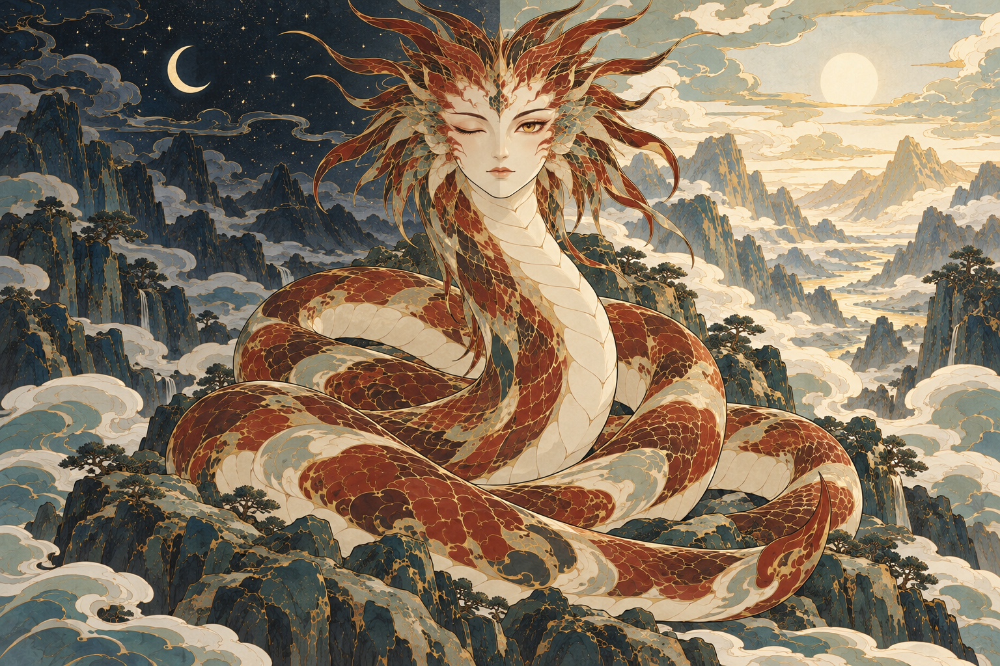

# 烛龙 · 中轴昼夜

最新状态：用户认为10版不够好看，已改为“睁眼的美丽蛇／水面倒影的闭眼人面”方案。本页保留中轴昼夜探索记录，10不作为认可参考或当前推荐候选。

用户提出：中轴构图，一侧闭眼是黑夜，一侧睁眼是白昼。

## 本次设计

- 同一张人面正面居中：观者左眼闭合对应夜侧，右眼睁开对应昼侧；不复制成两个烛龙。
- 中轴下方保留蛇躯盘绕岩台的承托关系，视觉平衡但不强求身体镜像，避免形成双身、双尾。
- 左侧深靛夜色，右侧骨白与淡赭金白昼，两侧山脊与谷气属于同一片地形；眼睛状态与环境形成直接联系。
- 一个眼闭、一个眼开的同时状态属于本幅象征性演绎。沿用原文“其暝乃晦，其视乃明”的语义，不把这种同时状态说成古籍的具体生理描述。
- 用户提供的[文字摘图](references/user-day-night-excerpt.png)仅作创意语境存档，未作为生图输入，也未把其中额外的历史判断当成核实结论。
- 输入09版用于盘身与岩台关系，穷奇彩稿用于共同画法；两者都不锁定新构图。

## 输出与检查

已完成 1 次内置生图，尚未获用户认可。

- **核心对应已出现**：正面单一人面位于中轴，画面左眼闭合、右眼睁开；左侧为深蓝夜色，右侧为浅暖白昼。两种眼睛状态与两侧环境可直接对应。
- **盘身与地形**：保留中央蛇躯盘绕岩台的承托关系，前后回环有松紧，右下方可见一个尾尖。没有为了左右平衡复制成两张脸或两个头。
- **系列画法**：赭红骨白主体、暖金细线、鳞组与装饰云片延续；环境仍有较多山石纹理和空间纵深。
- **待判断的细节**：头后鬃冠较大且顶部尖端出画，脸部较像人物肖像；生成器还加入了左侧月牙、右侧日轮，昼夜天空的中线分界比较直接。这些不是用户已认可的细节，也不在本轮自动追加修订。
- **本轮重点**：先确认中轴、单脸两眼状态、盘身和昼夜两侧的整体方案是否合适，再决定是否减少头饰、精简背景或柔化分界。

[完整实际提示词](prompts/10-zhulong-day-night-axis.txt) · [生成记录](manifest.json)
