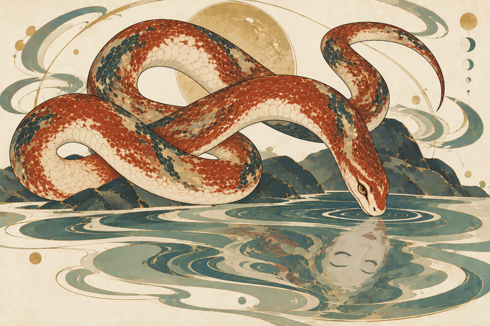

# 烛龙 · 保留原盘法，修复身体接续

起点为15版。用户指出身体在遮挡和盘绕上不连续，随后明确要求保留原来盘法，只理顺连接。

## 已排除的结果

- **16 螺旋盘法：不采用。** Agent将结构修复扩大成姿态重排；用户明确否定这种盘法。该调用已完成，结果保留为[历史记录](16-spiral-not-selected.png)，不作为后续输入。[实际提示词](prompts/16-continuous-coil.txt)。
- **17 原盘法文字修正：修复失败。** 从15重新编辑，外形近似保留，但用户明确指出“这一看就是不一条连续的蛇身”。结果保留为[失败记录](17-junctions-failed.png)。[实际提示词](prompts/17-original-coil-junctions.txt)。

## 18 结构参考修正

先按15的大弧位置制作[单条中心线路线图](18-continuity-guide.png)，再与原图一起输入图像编辑工具。路线图是独立技术示意，由[记录脚本](trace-guide.py)绘制，不是对成品图片的程序修图，也不替代实际生图。

路线顺序：右下蛇首 → 中央前颈 → 左下回环左端 → 回环右端 → 左上大拱左根 → 拱顶 → 大拱右侧 → 右上尾根 → 尾尖。

按该路线存在四处投影交叉：左下回环在前、前颈在后的一处；前颈覆盖后身的三处。路线图用局部断口表达遮挡，编号与颜色仅帮助追踪同一身体；最终图不应含这些诊断标记。

[18实际提示词](prompts/18-guided-junctions.txt)。结构图的连续性不构成最终插画已修复的证据，需在实际输出上重新追踪边界和遮挡关系。

18实际输出仍较大程度沿用了旧连接，未能确认按路线图重新建立四处接续，记录为[未解决](18-line-guide-not-resolved.png)，不标为修复成功。

## 19 实体结构参考

将同一连续路线扩展为[具有宽度和前后遮挡的身体结构图](19-body-structure-guide.png)，由[结构图脚本](build-body-guide.py)单独绘制。它沿用原来的四个大弧，不采用16的螺旋盘法；辅助配色只区分同一身体上的连续段。

19改变输入优先级：结构图为第一张，决定身体连接、宽度与遮挡；原15为第二张，提供蛇首、纹样、画法、倒影和背景。最终仍由内置生图工具绘制，不通过程序编辑成品图像。[19实际提示词](prompts/19-body-guide-render.txt)。

## 19检查记录

| 项目 | 状态 | 实际观察 |
| --- | --- | --- |
| 身体路径 | 通过初步目视检查，待人工复核 | 从蛇首回溯，前颈在左下交叉后接入回环，回环右端通过中部遮挡续回左上大拱，大拱的右后段再通向右上尾根。可以与实体结构图逐段对应；不能把结构图本身当作成品正确的唯一证据。 |
| 遮挡可读性 | 待人工判断 | 左下回环的前后边界较明确，中部回环内缘重新露出。前颈下方的后躯采用较暗的黛青色，视觉上仍可能与岩片混淆，需要重点看这一段。 |
| 画风与保留项 | 通过主要特征目视检查 | 原来的大拱、左下回环、右上尾巴、睁眼蛇首与倒置闭眼人面保留；主体仍为角色图版，背景仍抽象。没有诊断编号或辅助配色进入成品。 |
| 局部变化 | 已记录 | 回环间留白、蛇躯局部粗细、腹带及蛇首宽度有变化，并非逐像素保留15。是否仍满足用户对原姿态美感的要求待人工确认。 |
| 人工偏好 | 待人工判断 | 19尚未获用户认可；不替换已认可的穷奇资产。 |

[全部调用与输入输出记录](manifest.json)。本轮共4次内置生图；16方向被否定，17修复被用户否定，18未解决，19作为当前候选。两张独立结构图不计为生图调用。

后续用户反馈：19的“蛇身不够丰润舒展，自然重力垂落不够自然”。后续在保留原盘法与连接关系的前提下修订丰满程度、承托与悬垂；此反馈不作为19整体已获认可的证据。
