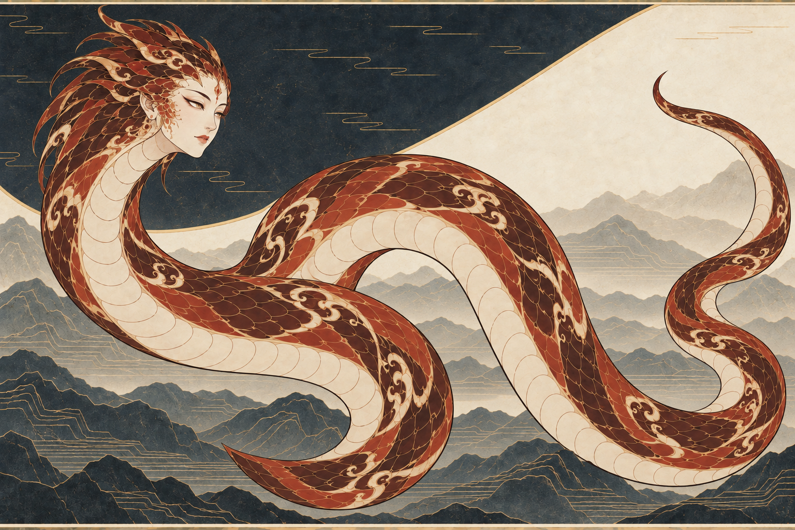
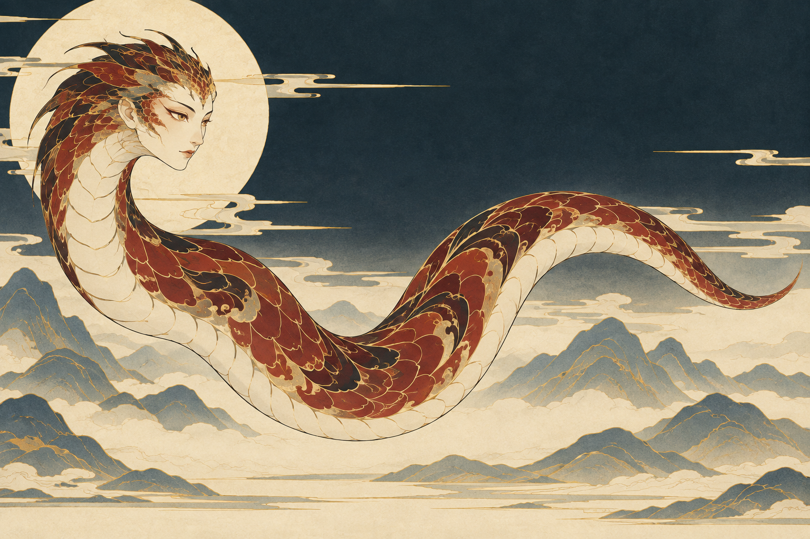

# 烛龙 · 形态融合与蛇躯清晰度

最新状态：用户明确否定08版外观，认为蛇形应保留盘曲的美感，要求先进入背景与动作重塑。本页保留当时的结构观察；“路径清晰”不代表美感通过，08不再是当前推荐候选。

用户要求开始烛龙定制：解决蛇身混沌不明、人头衔接突兀与诡异观感，并把图册中奇异的文字形态转译成可接受、值得欣赏的形象。

本轮采用原有细线、平面叠层和赭红骨白配色，重点重设计身体路径与头颈融合。背景沿用晦明层山的探索方向，不代表用户已认可该背景，也暂未展开新的故事场景。

## 本轮设计

- 身份不变：人面、蛇身、赤色；一个头、一条连续身躯、唯一尾尖，无足翼角。原文依据沿用[已核实档案](../../../.agents/skills/mythic-beast-mural/references/beasts.md)。
- 身体清晰：减少回绕与混淆身体的装饰带，先以开放波形验证头到尾的连贯；身体与腹带必须属于同一形体。
- 头颈融合：以古朴的人类五官体现人面，头壳、颊缘、后脑到颈部连续设计，以鳞片尺度与形状过渡；浅色下颌顺入喉腹，不使用独立人类细颈和胸肩。
- 气质：温润、安定、有灵性；保留神性与异兽特征，具体美感由用户判断。
- 对照基准：[上一版烛龙](../2026-09-23-background-test/05-zhulong-background.png)。

## 07 · 第一版编辑：暂不推荐

- 已有变化：原盘发珠饰改为鳞状头饰，额侧与颊缘出现细鳞，头颈关系比原图更连贯。
- 未解决的硬问题：下方偏左和右上同时出现尾状尖端，中央路径仍有不清楚的连接，不能确认是单一连续蛇身。
- 偏差：头后鳞片过长，容易读成羽冠；脸仍偏女性人物肖像。不能把这些偶然输出设为固定造型。
- [实际提示词](prompts/07-zhulong-integrated-form.txt)。输入旧烛龙为编辑目标、穷奇为画法参考。

## 08 · 重新构图

为摆脱旧身体路径的影响，本次只输入穷奇画法参考，按从左向右连续展开的单一身体路径重画，不继续沿用07的错误轮廓。

- 通过本轮目视结构检查：一个头、一条从左向右展开的蛇躯、右侧唯一渐细尾尖；无自交、分叉、第二尾端或额外足翼。骨白腹带随身体连续转向。
- 头颈观察：人类五官明确，额侧和颊侧细鳞接入后脑与颈部，浅色下颌至喉腹连续；相较原图，珠饰、盘发与粗环带已删除。但脸型、人耳仍较人形，是否充分消除用户所说的突兀与诡异，待人工判断。
- 风格观察：赭红、骨白与金色细线保留，鳞组与局部装饰层级可辨，身体主曲线更简明。头后鳞片仍略有鬃冠感，和提示词要求的低矮短鳞有偏差。
- 附带变化：重新构图使背景也发生变化，新增明显的浅色圆域与更多云带，天幕还有轻微明暗过渡；不属于严格背景保形编辑，也不能把这些背景元素视为已认可。本轮先聚焦蛇躯和头颈问题。
- [实际提示词](prompts/08-zhulong-clear-path.txt)。该图已被用户否定，作为失败方向留档。

## 验收重点

1. 能否从头到唯一尾尖直接追踪身体，是否还有假分叉、假尾或连接歧义？
2. 人面是否仍可辨，是否像同一个神兽自然长出的面容？
3. 气质是否自然、愿意欣赏，同时保留古意与异兽身份？
4. 整体精细度、平面感与线条是否仍符合图册？

本轮实际调用内置生图 2 次：一次编辑暴露残余结构错误，一次重构得到当前候选。所有新图均未获用户认可。完整调用、输入图与输出文件校验见[生成记录](manifest.json)。
