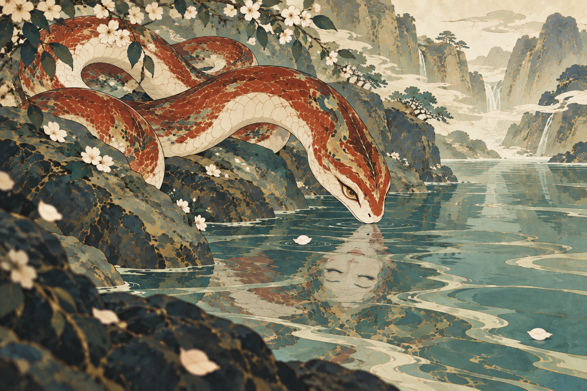
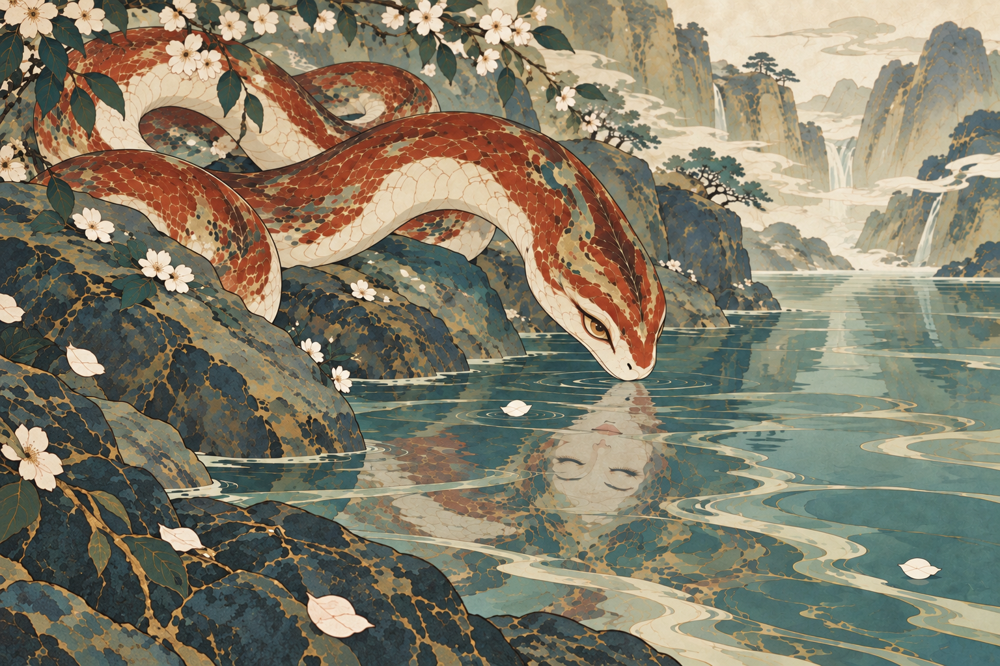

# 烛龙 · 潭边照影的场景画

**后续纠正：** 用户明确“还是不像档案画，需要对其他元素进行抽象化和符号化”。下述13／14基于Agent对上一句反馈的错误理解，场景画并非用户最终目标。两稿保留追溯，当前转向完整角色主体与抽象环境纹样。实际生成提示词保持原样，不改写历史调用。

用户方向：“像一幅场景画而不是角色的档案画”。本轮将其作为成图目标，延续“实体为睁眼的美丽蛇、水面倒影为闭眼的优雅人脸”的创意，重新组织场景取景。

## 设计依据

- 12版仅提供蛇与倒影的关系及颜色参考，不锁定原有正面铺陈的姿态；已认可穷奇只提供绘画语言。
- 斜向岩岸承托盘身，蛇向水面探颈；视线从岸石、蛇身移向蛇首，再发现倒影中的闭眼人面。环境从画外延续进来，水潭留出安静的空间。
- 山潭、落瓣先触水及蛇吻将近水面的瞬间均为原创设计，不作为《山海经》情节。人面倒影是用户指定的象征性改编。
- 内部“角色档案”用于设定与证据记录，不规定最终图像必须采用全身陈列、居中造型或档案卡形式。

## 13 · 场景重构

[完整实际提示词](prompts/13-zhulong-water-moment.txt)。

- 已观察：盘蛇集中在左侧岩岸，头向右下探出；水潭与远处峡谷形成向右打开的空间。真实蛇眼睁开，水中人面倒置、双眼闭合。与12相比，岸线和前后景更明确地参与构图。
- 明确需修：左下近景岩石、枝叶和花瓣出现摄影式失焦；与系列平面细线画法不符，已发起一次仅针对近景清晰度与平涂处理的修订。
- 待判断：盘身后段存在遮挡，完整的身体连接仍需关注；花枝和远景山水较丰富，是否符合用户希望的场景气质尚待人工决定。

## 14 · 近景画法修正

[实际修正提示词](prompts/14-foreground-flatness.txt)。针对13的近景失焦完成一次编辑：左下岩面、叶片和花瓣已改为清晰细线与平面片块。蛇的盘身、前探蛇首、睁眼状态、倒置闭眼人面和斜向岸线目视保留。

| 检查 | 状态 | 实际观察 |
| --- | --- | --- |
| 形态 | 待人工判断 | 可见一个睁眼蛇首，人面仅在水中且双眼闭合；后躯有岩石与枝叶遮挡，完整身体路径不能完全核验。 |
| 画风 | 待人工判断 | 近景失焦已修正，细线、有限矿物色和清晰形块可见；与穷奇的整体同系列感仍由用户判断。 |
| 场景与系列变化 | 通过本轮构图检查 | 左岸与向右打开的潭面共同组织姿态和视线，环境延伸到画外；是否足够有故事感与吸引力仍待用户确认。 |
| 保形 | 通过目视检查 | 13至14的蛇、倒影和岸线主要位置及轮廓保留，近景表面按目标改变；不声称逐像素一致。 |
| 人工偏好 | 待人工判断 | 蛇的美感、人面的优雅程度、花枝与远山是否过多，尚未获认可。 |

当前提交14供人工判断，不继续自动抽图。

## 人工验收重点

先判断这是否像在山潭边看见的一个瞬间，再判断蛇是否美丽、倒影是否优雅并属于同一角色，以及画法是否仍与穷奇参考同属一套。候选尚未获用户认可。

[逐次生成记录](manifest.json)。本轮2次内置生图：场景重构与一次近景画法修正。完整提示词、输入角色、输出副本与原始缓存均保留。
