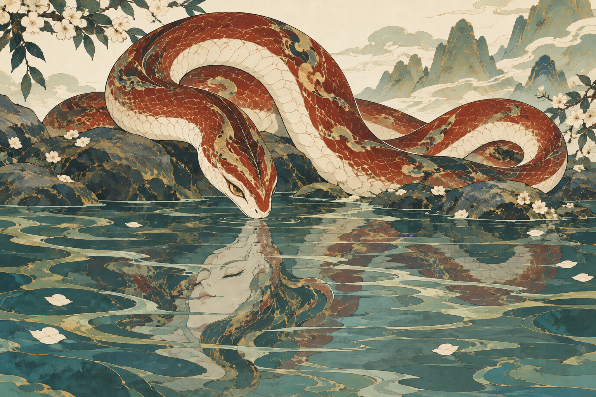
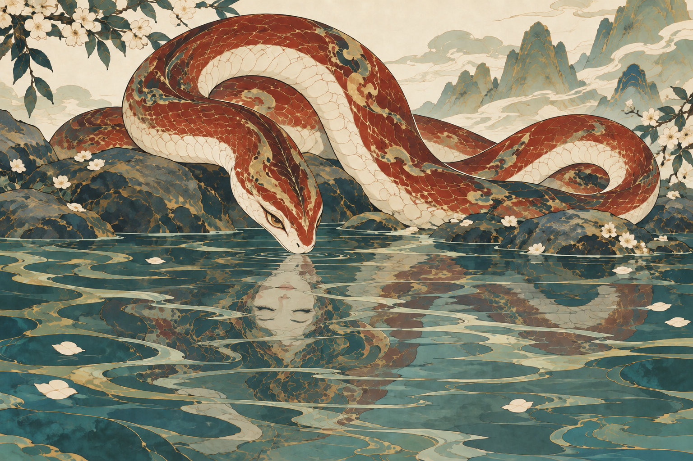

# 烛龙 · 蛇与人面倒影

用户新方案：主体是美丽的蛇，睁眼；蛇在水面的倒影是优雅的人脸，闭眼。10版中轴昼夜已被用户否定，本轮从新构图开始，未把旧的人头蛇身稿作为输入。

## 设计关系

- 水上保持完整蛇首与自然盘曲，蛇眼睁开，前颈俯向水面。
- 人面只存在于水中反射，眼睛闭合；位置、朝向、尺度和波纹共同说明它属于蛇的倒影。
- 通过虚实与反射表达复合身份，是用户指定的原创演绎，不声称古籍记载了倒影变脸。
- 配色延续赭红、骨白与细金纹，水岸改为浅山、低岩与静潭，整体仍用平面装饰画法。

## 11 · 初稿

- 可见的用户要求：水上为睁眼蛇首，身体盘曲；水中人面的眼睛闭合，脸部与水纹相融。
- 需修改处：倒影人面的五官顺序仍接近正立人像，朝向及尺度与蛇首反射不够一致，容易理解为水中另有一张人脸。
- 附带设计：生成了花枝与落花，这些是工具输出的装饰选择，尚未获认可。保留作为本轮整体气氛候选，不因此设为烛龙固定背景。
- [完整实际提示词](prompts/11-zhulong-human-reflection.txt)。只输入已认可穷奇彩稿作画法参考。

## 12 · 倒影关系修正

已对11完成一次定点编辑。[实际修正提示词](prompts/12-reflection-orientation.txt)。

- 人面已改为倒置，下颌靠近水线，闭合的双眼位于鼻唇下方、额头朝画面下方；尺寸也缩小，更接近蛇首下方的反射区域。
- 上方蛇首保持睁眼，盘身、低岩、花枝和远山的主要轮廓目视保留。没有重新出现实体人头蛇身。
- 人面以冷色与水平水纹融入反射，没有添加独立人的胸肩或衣服。仍属于有意改变面容的艺术倒影，不主张严格光学一致。
- 当前待判断：蛇是否足够美丽、盘曲是否自然；倒影人面是否优雅且读作同一角色，水纹密度是否影响可读性。12尚未获用户认可。

## 人工验收

先判断“水上的蛇与闭眼的人面倒影”这个意象是否自然、优雅；再看倒影是否像同一角色的映像，是否仍显得有一个独立人物在水里。所有输出均待用户认可。

[生成记录](manifest.json)

本轮共 2 次内置生图：新构图初稿与一次倒影定点修正。原始结果和工作区副本均保留。

后续方向：用户要求“像一幅场景画而不是角色的档案画”，已据此继续[13／14场景构图探索](../2026-09-23-zhulong-narrative/REVIEW.md)。11、12仍作为倒影关系的早期候选保留；该要求不等于认可这些候选或否定倒影创意。
