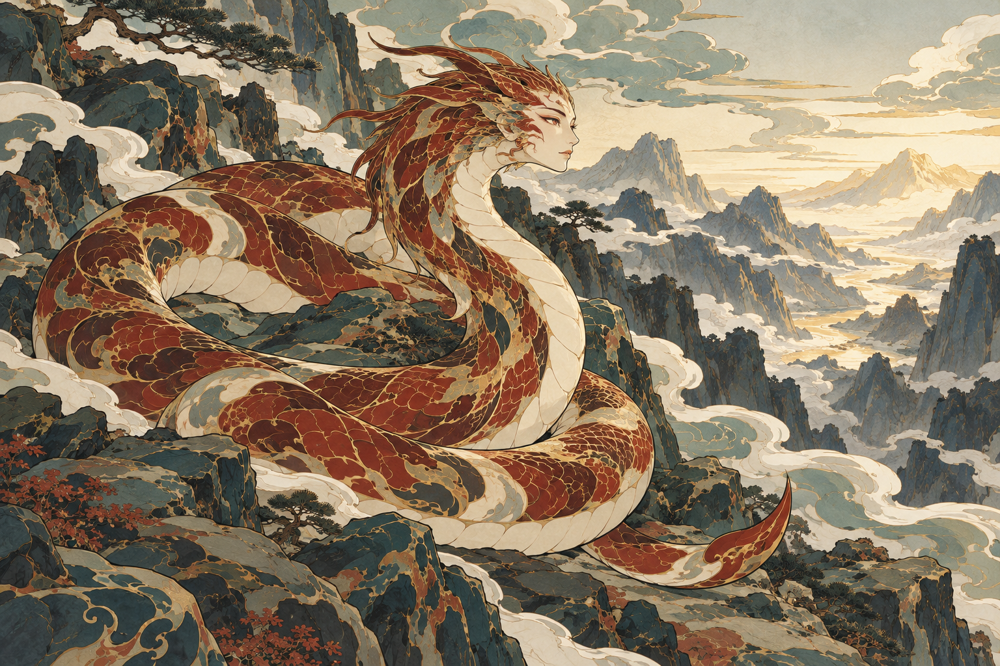

# 烛龙 · 场景与动作重塑

状态：1 次内置生图已完成，09版为待人工判断的场景首稿。08版已被用户否定，本轮未将它作为参考输入，也不继续孤立修饰头面。

## 本次设计

用户要求恢复蛇形应有的盘曲美感，先进入背景重塑阶段，希望通过场景中的动作重新组织角色。

选定瞬间：烛龙盘踞章尾山岩台，前颈抬起、转向谷口，眼初睁，山谷由晦转明。依据[《山海经·大荒北经》](https://zh.wikisource.org/wiki/山海經/大荒北經)的章尾山与“其暝乃晦，其视乃明”语义；岩台、盘踞抬首、视线与谷口以及明色传播方式均为本次原创场景演绎。

只输入已认可的穷奇彩稿作画法参考，以新构图组织角色与环境。[完整实际提示词](prompts/09-zhulong-awakening.txt) · [调用与文件校验记录](manifest.json)。

## 看图检查

- **盘曲与承托**：恢复饱满回环和前后穿插，身体绕过岩面并落在岩台上；较08版横向展开的悬浮波形，更能看到身体与地形的联系。头颈上提与下部盘身形成方向对照。
- **场景构图**：左侧及前景的深色高岩承托主体，视线向右侧谷口展开；远山和谷间云气通向浅暖色明域。背景不再仅是与主体无接触的装饰底纹。
- **瞬间感仍不足**：已见抬首凝视的姿态，但更接近安静盘踞。仅凭图像，难以明确判断“刚刚睁眼导致由晦转明”的因果与时间点；是否需要增强动作张力，待用户选择场景方向后再定。
- **画法与信息密度**：主体仍有红白色块、细线和鳞组；山石的颗粒、皴纹与空间纵深较穷奇基准更强，前景也较密，整体更偏叙事山水。是否符合图册的平面装饰程度，需人工判断。
- **形态本轮不定稿**：可见一个人面头首和右下尾端；盘绕与岩石遮挡处没有完成逐段连接定稿，脸型与鬃状头饰也未获认可。按用户要求，本轮不继续孤立修脸或把蛇躯重新拉直。

## 当前验收重点

先判断场景方向：盘踞岩台、抬首面向初明山谷的整体姿态与环境关系是否合适。之后再选择更强的动作瞬间、调整背景繁简，最后处理角色局部。09尚未成为已认可参考。
