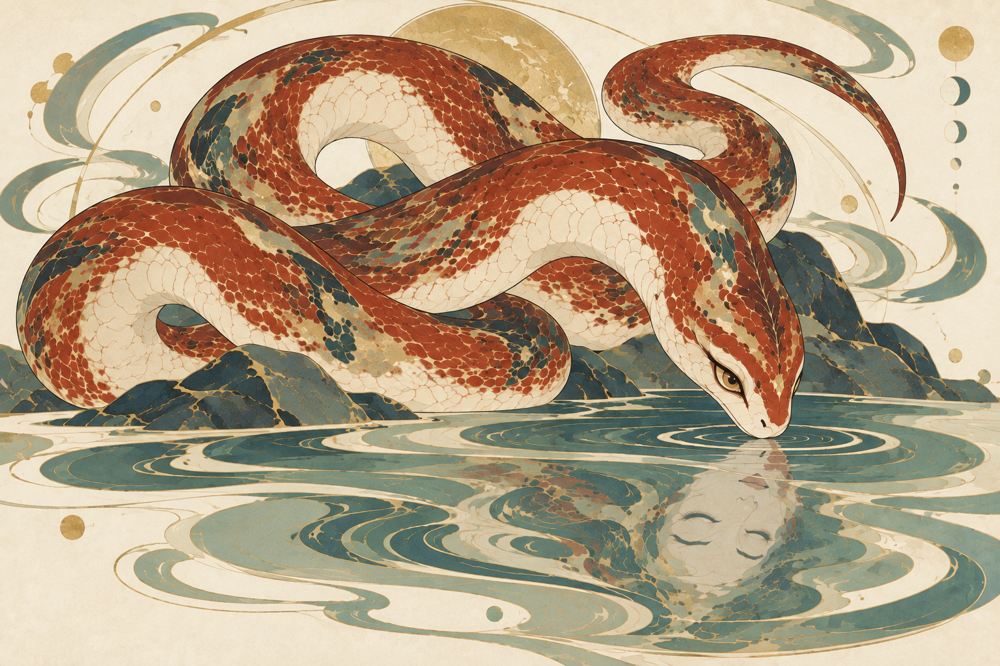

# 烛龙 · 环境符号化的角色图版

**用户反馈：** “蛇身在遮挡和盘绕的逻辑上并不连续”。15的形态状态据此改为需修改，以下背景变化不代表该图结构合格。后续仅重排蛇躯的盘曲和遮挡关系。

用户明确纠正：“还是不像档案画，需要对其他元素进行抽象化和符号化”。本轮以角色图版为目标，保留美丽的睁眼蛇与闭眼人面倒影，减少真实山水空间。

## 实际变化

- 主体放大并重新盘曲，蛇首、身体与单一可见尾端成为主要轮廓；背景回到米白留白。
- 原有峡谷、瀑布、花枝和摄影式景深被移除；岩岸压缩为少数平面色块，水面收为装饰性水纹带。
- 睁眼蛇首与下方倒置、闭眼的人面保持对应，倒影仍具有水纹与简化蛇颈反射。环境抽象化没有取消这一身份关系。
- 生成结果额外出现圆盘、月相和弧线装饰。这些是候选图中的工具输出，不是用户指定元素，也不是已核实的烛龙设定；不加入固定角色规则。

## 检查

| 检查 | 状态 | 实际观察 |
| --- | --- | --- |
| 形态 | 需修改 | 用户明确指出遮挡与盘绕不连续。单一实体蛇首与可见尾端不代表中间路径连贯，须重排中段穿插。 |
| 画风 | 待人工判断 | 细线、矿物色、平面色块和留白可见；岩面和水纹更具图案性。整体是否与穷奇匹配仍待判断。 |
| 环境与系列变化 | 通过本轮抽象化检查 | 远景空间已收去，岩、水成为围绕角色的局部装饰结构；圆盘和月相是否保留未定。 |
| 保形 | 按本轮重构范围完成 | 允许改变姿势与构图；保留赤蛇、盘曲、睁眼实体与闭眼人面倒影这组创意。 |
| 人工偏好 | 待人工判断 | 档案感、抽象程度、蛇的美感和人面的优雅程度尚未获认可。 |

## 文件与状态

[完整实际提示词](prompts/15-zhulong-symbolic-plate.txt) · [逐次生成记录](manifest.json)

本轮调用内置生图1次，输入14版仅作角色与倒影概念参考，输入穷奇彩稿仅作已认可画风参考。15为待人工验证候选，不替换原有认可资产。13／14保留为误解方向后产生的场景探索。
