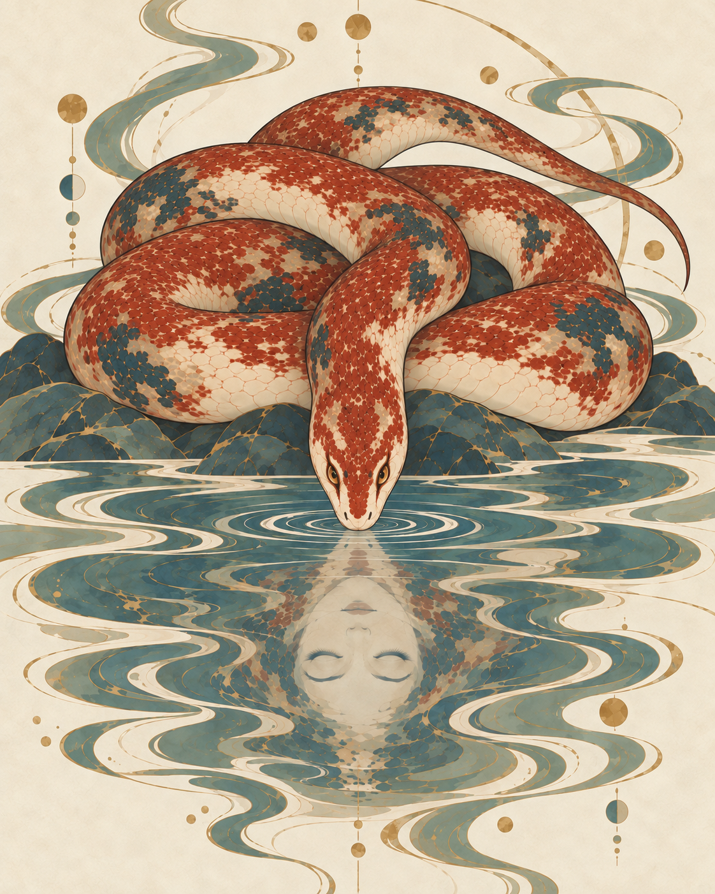

# 烛龙 · 上下中轴构图

用户最新方向：“干脆直接上下中轴构图”。23以21仅作蛇的外观、画法与倒影创意参考，重新安排布局；停止横幅右偏头尾的局部修订。22尾段提示词未调用，没有22生成图。

## 目视检查

| 项目 | 状态 | 实际观察 |
| --- | --- | --- |
| 上下中轴 | 通过布局检查 | 实体蛇首在正中向下俯，人面倒影位于同一竖直轴线下方；画面改为竖幅。盘身左右分布，不是两个镜像蛇头。 |
| 核心形象 | 通过可见特征检查 | 实体为睁眼的蛇首，下方人面倒置且双眼闭合，没有实体人头或水中人物身体。 |
| 盘绕与自然度 | 待人工判断 | 盘身更集中并由下方岩片承托，尾端顺一侧渐细。多处身体仍有遮挡，不能仅凭单头单尾和中轴成立就认定全部盘绕关系无误；丰润与垂落是否自然仍需用户判断。 |
| 画风与环境 | 待人工判断 | 米白底、朱砂与骨白蛇身、黛青水岩片面及细金纹保持，环境仍图案化。生成结果仍带圆点、月相与长弧线装饰，属于工具沿用的候选元素，未作为固定设定。 |
| 保留范围与偏好 | 待人工判断 | 按用户新指令允许重排姿势与画幅，原先右偏蛇首和右上尾巴不锁定。新的整体美感、蛇首正面感和人面尺度尚未获认可。 |

[完整实际提示词](prompts/23-vertical-reflection-axis.txt) · [生成记录](manifest.json) · [21参考稿](../2026-09-23-zhulong-weight/21-zhulong-grounded-loops.png)

本目录1次内置生图。23为待人工验证候选，不替换原有穷奇认可资产。
