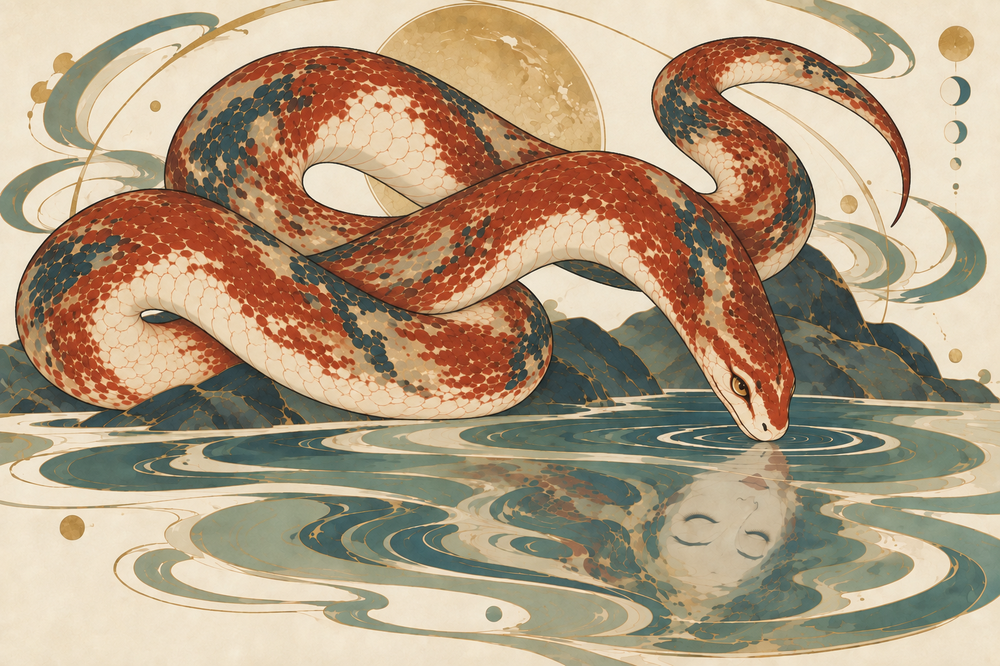
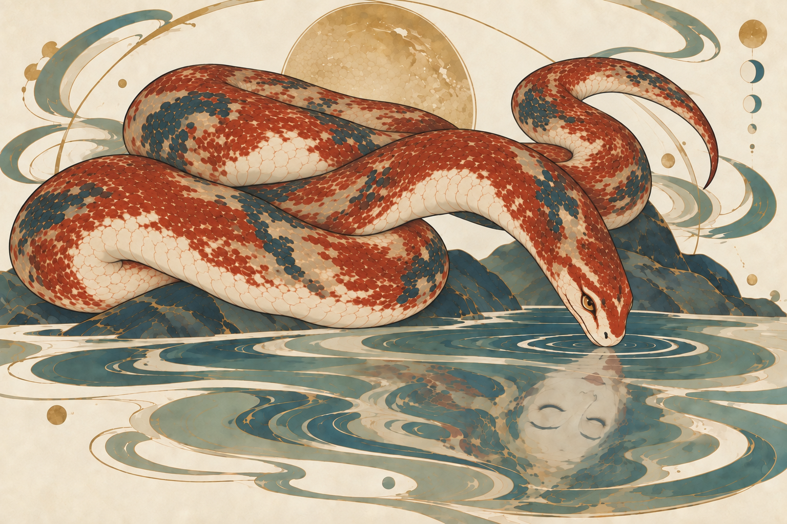

# 烛龙 · 丰润度与重力垂落

**20的用户反馈：** “还是不自然”。因此20不作为解决重力与自然体态问题的合格稿；本轮继续调整承托、悬空高度、躺卧方向与腹面转向，保留原盘法。

用户反馈：“蛇身不够丰润舒展，自然重力垂落不够自然”。本轮编辑19，保留原来的大回环布局、头尾关系、抽象环境和闭眼人面倒影。

## 目视检查

| 项目 | 状态 | 实际观察 |
| --- | --- | --- |
| 丰满程度 | 通过本轮变化检查 | 左下回环、上方大拱与前颈中段均比19更厚实；下方盘身与承托面的接触较宽，回环转弯更圆润。是否符合用户希望的丰润感仍待确认。 |
| 重力与舒展 | 待人工判断 | 上方大拱略低，中段与下方盘身贴合更明显，前颈向水面收束。改动较温和，仍保有原来的高起回环和主动探头曲线，不宣称重力问题已完全解决。 |
| 连续与遮挡 | 待人工复核 | 19的大段次序与交叉位置目视保留，没有额外头尾；加厚后部分回环间隙缩小，须确认不会重新影响连接的可读性。 |
| 画风与保形 | 通过主要特征目视检查 | 赤色鳞纹、骨白腹片、细金线和矿物色保持；蛇首仍睁眼，水中人面倒置且闭眼，背景仍为岩水符号与留白。 |
| 人工偏好 | 待人工判断 | 本轮候选未获用户认可。丰满、舒展与垂落是否达到目标，需要人工验收。 |

[原19版本](../2026-09-23-zhulong-continuity/19-original-coil-connected.png) · [实际提示词](prompts/20-fullness-and-drape.txt) · [生成记录](manifest.json)

20使用19作唯一输入。没有替换为新盘法，也没有新增身体结构图或程序修图。

## 21 承托与斜卧修订

[实际提示词](prompts/21-grounded-loops.txt)。21以20为唯一编辑目标，上方后圈明显降低、改为较扁的斜卧形，下方盘身与接触面更贴合；蛇首、人面倒影与抽象环境保留。右上尾段仍较高，Agent计划进行一次定点修正，但尚未调用工具时用户已改为上下中轴构图。

[22尾段修正提示词](prompts/22-tail-support.txt)仅为未执行草案，没有对应生成图片。停止该分支并转入上下中轴，不等于21已经获用户认可。

本目录累计2次内置生图：20与21。23在独立目录继续上下中轴方案。
